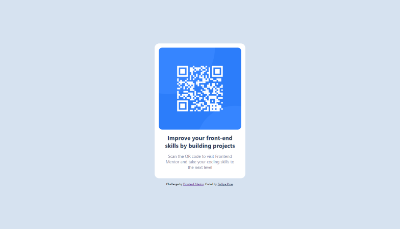

# Frontend Mentor - QR code component solution

This is a solution to the [QR code component challenge on Frontend Mentor](https://www.frontendmentor.io/challenges/qr-code-component-iux_sIO_H). Frontend Mentor challenges help you improve your coding skills by building realistic projects.

## Table of contents

- [Overview](#overview)
  - [Screenshot](#screenshot)
  - [Links](#links)
- [My process](#my-process)
  - [Built with](#built-with)
  - [What I learned](#what-i-learned)
  - [Continued development](#continued-development)
  - [Useful resources](#useful-resources)
- [Author](#author)

## Overview

### Screenshot

### Links

- Solution URL: [Add solution URL here](https://your-solution-url.com)
- Live Site URL: [Add live site URL here](https://your-live-site-url.com)

## My process

### Built with

- Semantic HTML5 markup
- CSS custom properties
- Flexbox
- Mobile-first workflow

### What I learned

- BEM (Block, Element, Modifier) methodology.

### Continued development

- Try to solve this challenge using Grid layout.

### Useful resources

- [Screen height](https://stackoverflow.com/questions/27612931/styling-html-and-body-selector-to-height-100-vs-using-100vh) - Difference between using **height** `100%` and `100vh` in order to fulfill the whole screen.
- [Live Server](https://marketplace.visualstudio.com/items?itemName=ritwickdey.LiveServer) - **VS Code extension** that allows you to launch a local development server with live reload feature for static & dynamic pages.

## Author

- Website - [Fellipe Pires](https://fthomasvp.github.io/)
- Frontend Mentor - [@fthomasvp](https://www.frontendmentor.io/profile/fthomasvp)
